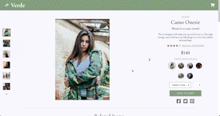

# Verde 🍃

A legacy client-facing retail web-portal needed a complete redesign and modernization. Our team of four engineers at Verde redesigned the portal and implemented features that enable customers to search, browse, add to cart, and checkout.

## Motivation

Verde is a project created by the team to flex our front-end development skills.

## Demo

## Contributors

- [Kenny Tran](https://github.com/kennytran95) - Ratings & Reviews
- [Andres Arango](https://github.com/arangotang) - Overview + Cart
- [Ryan Snow](https://github.com/r-snow) - Related Items + Ratings & Reviews
- [Linna Li](https://github.com/lucky89nana) - Questions & Answers

## Technologies Used

### Setup and Configuration

### Front End Development

